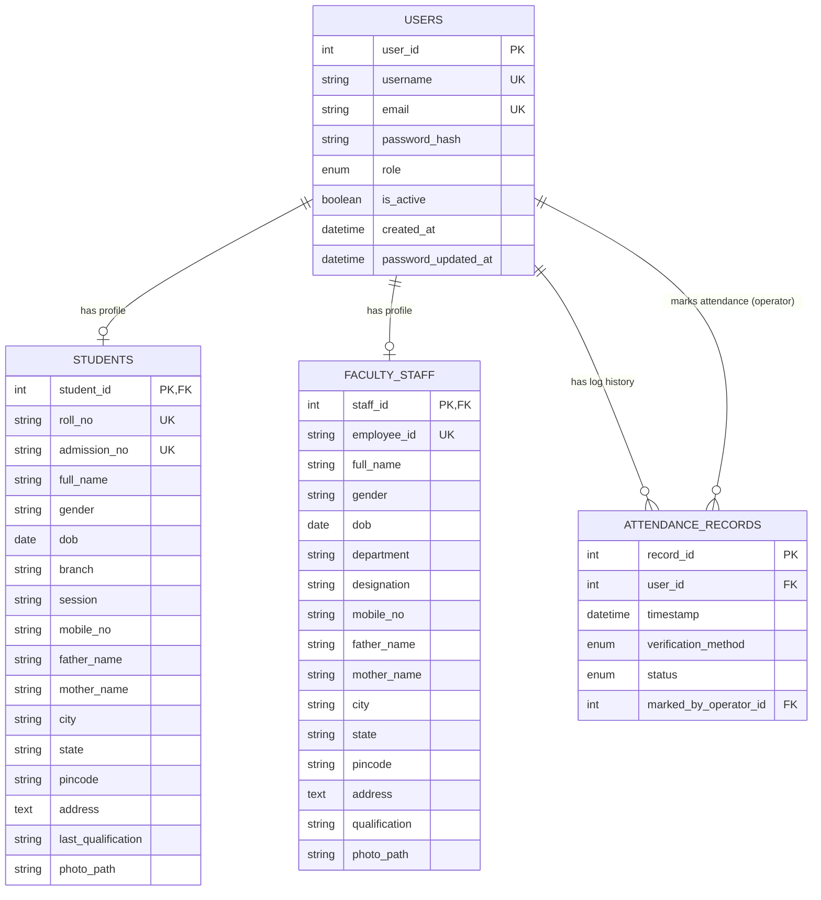

1. Flask Routes & Request Handling
   Authentication Flow: User registration (/register) with profile photo upload, password hashing, and user session sign-in (/login & /logout).

Role-Based Access Control (RBAC): Restrict access so only authenticated Teachers/Faculty/Admins can view the live terminal and summary reports.

2. Facial Recognition Engine Core (face_recognition / OpenCV)
   Image Encoding on Registration: When a new student/faculty registers, extract and store their facial feature embeddings (encodings) in the database or local storage.

Live Video Feed Endpoint (/video_feed): Stream live webcam frames to the browser via OpenCV MJPEG stream.

Face Detection & Verification: Detect faces in real-time, compute feature distances against saved encodings, draw bounding boxes around recognized faces, and mark attendance automatically.

3. Database Schema & Models (SQLite / SQLAlchemy)
   User Model: id, roll_id, full_name, email, password_hash, role, course_department, face_encoding_path.

AttendanceRecord Model: id, user_id, timestamp, date, status (Present/Absent), verification_method (Face AI / Manual).

4. Dynamic Attendance Summary & Export
   Live Filtering: Query attendance records dynamically by Date, Branch, and Search query (Name / Roll No.).

Pagination Support: Server-side pagination matching the limit set by the records-per-page dropdown.

CSV Export Route (/export-csv): Generate downloadable CSV reports on demand.

Where would you like to start?
Setting up Database Models & Authentication (app.py + SQLAlchemy)

Building the OpenCV / Facial Recognition Pipeline (camera.py)

Implementing Table Filtering & CSV Export API

# Layout of project files and directory

Face-Recognition-Attendance-System/
├── config.py
├── extensions.py
├── models.py
├── app.py
├── routes/
│ ├── **init**.py
│ ├── auth.py
│ └── main.py
├── static/
│ ├── css/
│ │ └── style.css
│ └── uploads/
│ ├── faces/ # Reference images uploaded during registration
│ └── encodings/ # Serialized face encoding feature vectors (.npy files)
└── templates/
├── base.html
├── login.html
├── register.html
├── attendance.html
└── attendance_summary.html

# Smart Face Recognition Attendance System

## Database Schema, System Architecture & UML Documentation

---

## 1. Entity Schema Refinements & Recommendations

To align with enterprise web development and database normalization practices, the system separates identity profiles from authentication credentials while enforcing **Role-Based Access Control (RBAC)**.

### Key Architectural Decisions:

1. **Unification of Person Profiles:** Separate `Student` and `Faculty/Staff` tables are linked to a central `User` (Authentication) entity via a 1-to-1 relationship. This eliminates credential duplication.
2. **Primary & Foreign Key Strategy:** An auto-incrementing integer `user_id` serves as the surrogate primary key for relational mapping. Domain identifiers (`roll_no`, `employee_id`) are maintained as unique candidate keys.
3. **Data Normalization:** Attendance logs store only reference foreign keys (`user_id`). Demographical data (`full_name`, `branch`, `department`) is dynamically joined when generating reports.

---

## 2. Refined Database Schemas

### Table: `users` (Authentication & Core Identity)

| Field Name            | Data Type    | Constraints                 | Description                                             |
| :-------------------- | :----------- | :-------------------------- | :------------------------------------------------------ |
| `user_id`             | INTEGER      | PK, Auto Increment          | Unique system surrogate key                             |
| `username`            | VARCHAR(50)  | UNIQUE, NOT NULL            | Account login handle                                    |
| `email`               | VARCHAR(120) | UNIQUE, NOT NULL            | Primary email address                                   |
| `password_hash`       | VARCHAR(255) | NOT NULL                    | Werkzeug/Bcrypt password hash                           |
| `role`                | ENUM         | NOT NULL                    | Options: `'student'`, `'faculty'`, `'staff'`, `'admin'` |
| `is_active`           | BOOLEAN      | DEFAULT `TRUE`              | Account status flag                                     |
| `created_at`          | TIMESTAMP    | DEFAULT `CURRENT_TIMESTAMP` | Profile creation timestamp                              |
| `password_updated_at` | TIMESTAMP    | NULLABLE                    | Password last changed timestamp                         |

---

### Table: `students` (Student Profile Details)

| Field Name           | Data Type    | Constraints                          | Description                           |
| :------------------- | :----------- | :----------------------------------- | :------------------------------------ |
| `student_id`         | INTEGER      | PK, FK $\rightarrow$ `users.user_id` | Linked authentication user ID         |
| `roll_no`            | VARCHAR(50)  | UNIQUE, NOT NULL                     | Official university roll number       |
| `admission_no`       | VARCHAR(50)  | UNIQUE, NOT NULL                     | Unique admission/enrollment ID        |
| `full_name`          | VARCHAR(100) | NOT NULL                             | Complete legal name                   |
| `gender`             | VARCHAR(15)  | NOT NULL                             | Gender specification                  |
| `dob`                | DATE         | NOT NULL                             | Date of birth                         |
| `branch`             | VARCHAR(100) | NOT NULL                             | Academic course/branch                |
| `session`            | VARCHAR(20)  | NOT NULL                             | Academic session (e.g., 2025-2029)    |
| `mobile_no`          | VARCHAR(15)  | NOT NULL                             | Primary contact phone number          |
| `father_name`        | VARCHAR(100) | NOT NULL                             | Father's name                         |
| `mother_name`        | VARCHAR(100) | NOT NULL                             | Mother's name                         |
| `city`               | VARCHAR(50)  | NOT NULL                             | Residential city                      |
| `state`              | VARCHAR(50)  | NOT NULL                             | Residential state                     |
| `pincode`            | VARCHAR(10)  | NOT NULL                             | Postal code                           |
| `address`            | TEXT         | NOT NULL                             | Full residential address              |
| `last_qualification` | VARCHAR(100) | NOT NULL                             | Previous academic degree/school       |
| `photo_path`         | VARCHAR(255) | NULLABLE                             | Relative path to reference face photo |

---

### Table: `faculty_staff` (Faculty & Staff Profile Details)

| Field Name      | Data Type    | Constraints                          | Description                           |
| :-------------- | :----------- | :----------------------------------- | :------------------------------------ |
| `staff_id`      | INTEGER      | PK, FK $\rightarrow$ `users.user_id` | Linked authentication user ID         |
| `employee_id`   | VARCHAR(50)  | UNIQUE, NOT NULL                     | Faculty/Staff employee ID             |
| `full_name`     | VARCHAR(100) | NOT NULL                             | Complete legal name                   |
| `gender`        | VARCHAR(15)  | NOT NULL                             | Gender specification                  |
| `dob`           | DATE         | NOT NULL                             | Date of birth                         |
| `department`    | VARCHAR(100) | NOT NULL                             | Academic/Administrative department    |
| `designation`   | VARCHAR(100) | NOT NULL                             | Job title (e.g., Assistant Professor) |
| `mobile_no`     | VARCHAR(15)  | NOT NULL                             | Primary contact phone number          |
| `father_name`   | VARCHAR(100) | NOT NULL                             | Father's name                         |
| `mother_name`   | VARCHAR(100) | NOT NULL                             | Mother's name                         |
| `city`          | VARCHAR(50)  | NOT NULL                             | Residential city                      |
| `state`         | VARCHAR(50)  | NOT NULL                             | Residential state                     |
| `pincode`       | VARCHAR(10)  | NOT NULL                             | Postal code                           |
| `address`       | TEXT         | NOT NULL                             | Full residential address              |
| `qualification` | VARCHAR(100) | NOT NULL                             | Highest qualification degree          |
| `photo_path`    | VARCHAR(255) | NULLABLE                             | Relative path to reference face photo |

---

### Table: `attendance_records` (Attendance Event Logs)

| Field Name              | Data Type | Constraints                                | Description                                |
| :---------------------- | :-------- | :----------------------------------------- | :----------------------------------------- |
| `record_id`             | INTEGER   | PK, Auto Increment                         | Attendance log ID                          |
| `user_id`               | INTEGER   | FK $\rightarrow$ `users.user_id`           | Identified student or staff ID             |
| `timestamp`             | DATETIME  | DEFAULT `CURRENT_TIMESTAMP`                | Precise date and time marked               |
| `verification_method`   | ENUM      | DEFAULT `'Face AI'`                        | Options: `'Face AI'`, `'Manual'`, `'Card'` |
| `status`                | ENUM      | DEFAULT `'Present'`                        | Options: `'Present'`, `'Absent'`, `'Late'` |
| `marked_by_operator_id` | INTEGER   | FK $\rightarrow$ `users.user_id`, NULLABLE | ID of faculty/admin executing scan         |

---

Note: user cli password reset query
python -c "from app import create_app; from extensions import db; from models import User; app = create_app(); ctx = app.app_context(); ctx.push(); u = User.query.filter_by(username='your_username').first(); u.set_password('Student@123') if u else print('User not found'); db.session.commit() if u else None; print(f'Password for {u.username} reset to: Student@123') if u else None"

## 3. Entity-Relationship (ER) Diagram

# Object-Oriented UML Class Diagram

classDiagram
class User {
+int userId
+String username
+String email
-String passwordHash
+Role role
+Boolean isActive
+DateTime createdAt
+DateTime passwordUpdatedAt
+verifyPassword(password: String) Boolean
+updatePassword(newPassword: String) Void
}

    class Student {
        +int studentId
        +String rollNo
        +String admissionNo
        +String fullName
        +String gender
        +Date dob
        +String branch
        +String session
        +String mobileNo
        +String fatherName
        +String motherName
        +String city
        +String state
        +String pincode
        +String address
        +String lastQualification
        +String photoPath
        +getProfileDetails() Object
    }

    class FacultyStaff {
        +int staffId
        +String employeeId
        +String fullName
        +String gender
        +Date dob
        +String department
        +String designation
        +String mobileNo
        +String fatherName
        +String motherName
        +String city
        +String state
        +String pincode
        +String address
        +String qualification
        +String photoPath
        +getProfileDetails() Object
    }

    class AttendanceRecord {
        +int recordId
        +int userId
        +DateTime timestamp
        +VerificationMethod verificationMethod
        +AttendanceStatus status
        +int markedByOperatorId
        +markAttendance() Void
        +exportRecord() String
    }

    class Role {
        <<enumeration>>
        STUDENT
        FACULTY
        STAFF
        ADMIN
    }

    class VerificationMethod {
        <<enumeration>>
        FACE_AI
        MANUAL
        CARD
    }

    class AttendanceStatus {
        <<enumeration>>
        PRESENT
        ABSENT
        LATE
    }

    User "1" -- "0..1" Student : specializes
    User "1" -- "0..1" FacultyStaff : specializes
    User "1" -- "0..*" AttendanceRecord : logs
    User -- Role
    AttendanceRecord -- VerificationMethod
    AttendanceRecord -- AttendanceStatus

# Use Case Diagram

graph TD
UserActor((Base User))
StudentActor((Student))
FacultyActor((Faculty / Operator))
AdminActor((System Admin))

    subgraph Smart Attendance System Scope
        UC1[Sign In & Authenticate]
        UC2[Live Terminal Face Scanning]
        UC3[Mark Attendance via AI]
        UC4[View Personal Attendance History]
        UC5[View Class Attendance Summary]
        UC6[Filter & Search Records]
        UC7[Export Attendance CSV Report]
        UC8[Register New Student/Faculty Profile]
    end

    UserActor --> UC1
    StudentActor --> UC4
    FacultyActor --> UC2
    FacultyActor --> UC3
    FacultyActor --> UC5
    FacultyActor --> UC6
    FacultyActor --> UC7
    AdminActor --> UC8

# Sequence Diagram (Face Recognition Marking Sequence)

sequenceDiagram
autonumber
actor Operator as Faculty / Operator
participant Client as Frontend (Live Terminal UI)
participant Server as Flask Backend
participant Engine as OpenCV / Face AI Pipeline
participant DB as SQLite Database

    Operator->>Client: Open Live Terminal
    Client->>Server: Request Video Stream (/video_feed)
    Server->>Engine: Initialize Camera & Capture Frames
    Engine->>DB: Fetch Saved Face Encodings
    DB-->>Engine: Return Encodings & User IDs
    Engine->>Engine: Run HOG/CNN Face Detection
    Engine->>Engine: Compute Euclidean Distance & Match

    alt Match Found
        Engine-->>Server: Return Matched User ID
        Server->>DB: Save AttendanceRecord (Status='Present', Method='Face AI')
        DB-->>Server: Transaction Committed
        Server-->>Client: Send WebSocket / JSON Verification Success
        Client-->>Operator: Display "Attendance Marked" Notification Badge
    else No Match / Low Confidence
        Engine-->>Server: Unknown Face Detected
        Server-->>Client: Highlight Dynamic Red Bounding Box
    end

# System Flow Diagram (Mermaid)

flowDiagram
flowchart TD
Start([Start: User Accesses System]) --> Login{Is User Authenticated?}

    Login -- No --> Credentials[Enter Credentials / Sign In]
    Credentials --> ValidAuth{Valid Credentials?}
    ValidAuth -- No --> AuthErr[Show Error Toast] --> Credentials
    ValidAuth -- Yes --> Terminal[Navigate to Live Camera Terminal]

    Login -- Yes --> Terminal

    Terminal --> CamInit[Initialize Webcam / Video Stream]
    CamInit --> FrameCap[Capture Video Frame in Real-Time]
    FrameCap --> FaceDetect{Face Detected in Frame?}

    FaceDetect -- No --> DrawNoBox[Display Live Feed / Waiting state] --> FrameCap

    FaceDetect -- Yes --> ExtractEncoding[Extract Facial Features / Encoding]
    ExtractEncoding --> LoadDB[(Fetch Known Encodings from Database)]

    LoadDB --> CompareFaces{Match Found? Distance <= Threshold}

    CompareFaces -- No --> Unmatched[Draw Red Bounding Box: 'Unknown'] --> FrameCap

    CompareFaces -- Yes --> CheckDuplicate{Already Marked Present Today?}

    CheckDuplicate -- Yes --> AlreadyMarked[Display Warning: 'Already Marked'] --> FrameCap

    CheckDuplicate -- No --> LogAttendance[Save Attendance Record to DB]
    LogAttendance --> SaveDB[(Update 'attendance_records' Table)]
    SaveDB --> GreenBox[Draw Green Bounding Box with Student Name]
    GreenBox --> ShowToast[Trigger Success Notification Toast]
    ShowToast --> FrameCap

# Option 3: Manual Design Layout Guide (If Drawing Yourself)

If you are using tools like PowerPoint, Figma, or Canva,
follow this layout structure

- Pill/Oval Shapes (Start / End):
  [Start: User Accesses System]

- Diamond Shapes (Decision Steps):
  Is User Authenticated?Valid Credentials?Face Detected in Frame?Match Found? (Distance <= Threshold)Already Marked Present Today?Rectangle Shapes (Process Steps):Initialize Webcam Stream $\rightarrow$ Capture Video Frame $\rightarrow$ Extract Facial Features $\rightarrow$ Save Attendance RecordCylinder / Database Shapes:Known Encodings Databaseattendance_records TableColor Coding Recommendation:Blue / Dark Blue: Process steps & Camera controls.Green: Success states (Draw Green Box, Show Success Toast).Red / Warning: Failure states (Auth Error, Unknown Face Red Box).
