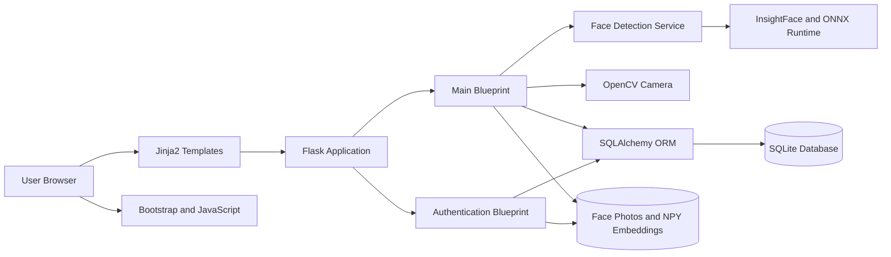
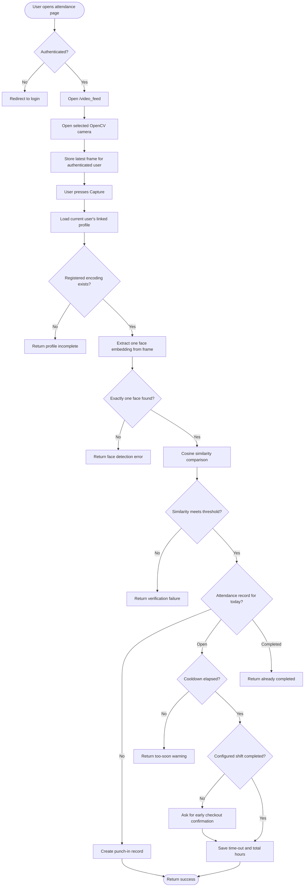
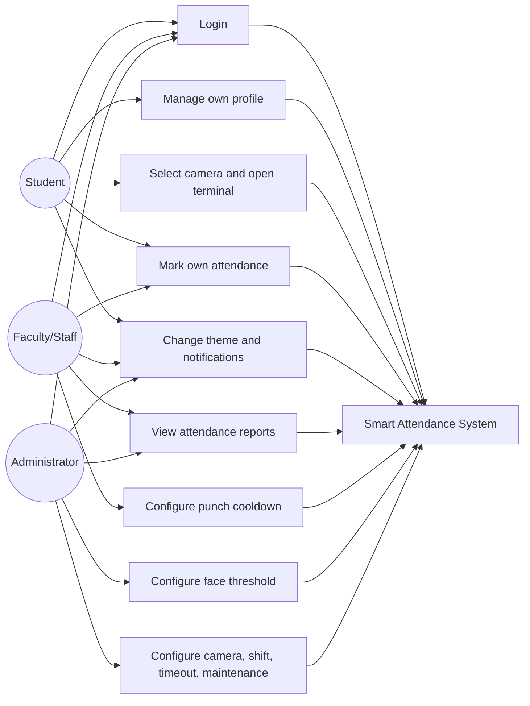
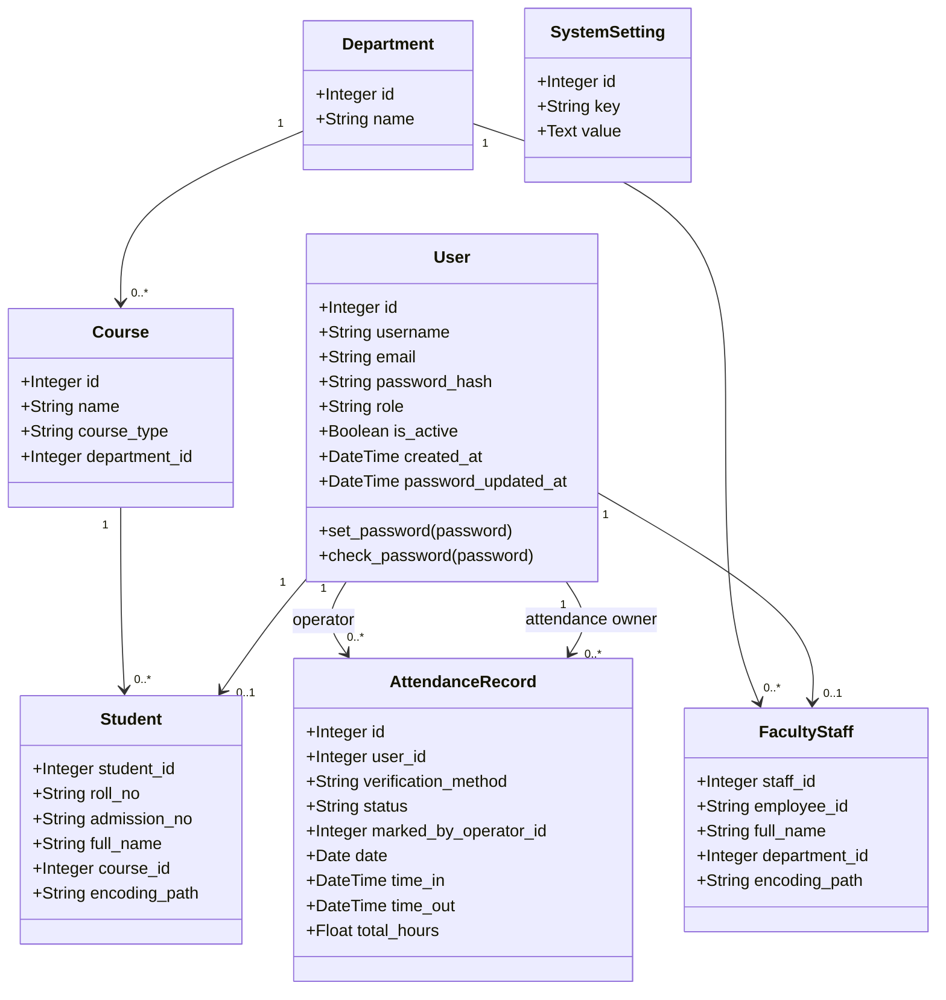

# Project Documentation
## Smart Face Recognition Attendance System

## 1. Project Overview

The Smart Face Recognition Attendance System is a web application that records attendance through face verification. It combines a Flask web server, SQLAlchemy persistence, OpenCV camera streaming, and InsightFace embeddings.

The application supports two related workflows:

1. **Account and biometric enrollment:** a user registers, uploads a face photograph, and receives a stored face embedding.
2. **Attendance verification:** the authenticated user opens the attendance terminal, the server reads the selected camera stream, compares a live face embedding with the registered embedding, and records punch-in or punch-out activity.

The project also provides attendance reporting, CSV export, user profile management, password management, and role-aware settings.

## 2. Objectives

- Reduce manual attendance work.
- Improve identity verification using facial biometrics.
- Maintain normalized records for users, profiles, academic organization, and attendance events.
- Provide accessible reports for attendance monitoring.
- Support configurable camera and attendance behavior.
- Provide a maintainable web architecture suitable for future deployment.

## 3. Scope

### Included

- Student, faculty, staff, and admin role concepts.
- Login, registration, logout, password change, and password reset.
- Student and faculty/staff profile entities.
- Department and course reference entities.
- Face image and embedding storage.
- Live camera stream and face verification.
- Daily punch-in and punch-out attendance.
- Search, date, course, and status filters.
- Pagination and CSV export.
- Responsive settings, profile, attendance, and summary pages.

### Current Boundaries

- The camera is accessed by the server process through OpenCV.
- Embeddings are stored as local `.npy` files rather than in a dedicated biometric store.
- Email delivery for password reset is not configured; the reset link is currently printed by the server for development.
- The project uses SQLite and does not yet include a formal migration system.
- Automated tests are still a required next step.

## 4. System Architecture



### Architectural Layers

| Layer | Responsibility | Main Files |
| --- | --- | --- |
| Presentation | HTML views, forms, responsive layout, browser interactions | `templates/`, `static/css/`, `static/js/` |
| Routing | HTTP endpoints, authentication flow, validation, response formatting | `routes/auth.py`, `routes/main.py` |
| Domain services | Face detection, embedding extraction, embedding comparison | `services/face_detection.py` |
| Persistence | Users, profiles, attendance, organization, settings | `models.py`, `extensions.py` |
| Infrastructure | Flask setup, configuration, rate limiting, upload folders | `app.py`, `config.py`, `rate_limiter.py` |

## 5. Request and Attendance Flow



## 6. Authentication and Authorization

### Roles

| Role | Intended access |
| --- | --- |
| `student` | Own attendance, own profile, personal preferences |
| `faculty` | Own attendance, operational cooldown, reports according to current route scope, personal preferences |
| `staff` | Own attendance, operational cooldown, reports according to current route scope, personal preferences |
| `admin` | Global AI, camera defaults, shift duration, timeout, maintenance, and operational settings |

Public registration accepts student/faculty/staff roles. Admin accounts should be provisioned through a controlled administrative process rather than public registration.

### Authentication Controls

- Flask-Login manages authenticated sessions.
- Passwords are hashed with Werkzeug.
- CSRF protection is enabled for form requests.
- Login, registration, password reset, and password change routes are rate limited.
- The application requires an explicit `SECRET_KEY` environment variable.
- Password reset tokens are signed and time-limited.

## 7. Use Case Diagram



## 8. Database Design

The database uses a normalized identity structure. Authentication data is stored in `users`; role-specific details are stored in `students` or `faculty_staff`.

### Entity Relationship Diagram

```mermaid
erDiagram
    USERS ||--o| STUDENTS : owns
    USERS ||--o| FACULTY_STAFF : owns
    DEPARTMENTS ||--o{ COURSES : contains
    DEPARTMENTS ||--o{ FACULTY_STAFF : employs
    COURSES ||--o{ STUDENTS : enrolls
    USERS ||--o{ ATTENDANCE_RECORDS : receives
    USERS ||--o{ ATTENDANCE_RECORDS : operates

    USERS {
        integer id PK
        string username UK
        string email UK
        string password_hash
        string role
        boolean is_active
        datetime created_at
        datetime password_updated_at
    }

    STUDENTS {
        integer student_id PK, FK
        string roll_no UK
        string admission_no UK
        string full_name
        string gender
        date dob
        integer course_id FK
        string session
        string mobile_no
        string father_name
        string mother_name
        string city
        string state
        string pin_code
        text address
        string last_qualification
        string photo_path
        string encoding_path
    }

    FACULTY_STAFF {
        integer staff_id PK, FK
        string employee_id UK
        string full_name
        string gender
        date dob
        integer department_id FK
        string designation
        string mobile_no
        string father_name
        string mother_name
        string city
        string state
        string pin_code
        text address
        string qualification
        string photo_path
        string encoding_path
    }

    DEPARTMENTS {
        integer id PK
        string name UK
    }

    COURSES {
        integer id PK
        string name
        string course_type
        integer department_id FK
    }

    ATTENDANCE_RECORDS {
        integer id PK
        integer user_id FK
        string verification_method
        string status
        integer marked_by_operator_id FK
        date date UK_USER_DATE
        datetime time_in
        datetime time_out
        float total_hours
    }

    SYSTEM_SETTINGS {
        integer id PK
        string key UK
        text value
    }
```

`AttendanceRecord` has a unique constraint on `(user_id, date)`. `SystemSetting` stores global keys and per-user camera keys in the form `camera_source_user_<user_id>`.

### Database Table Summary

| Table | Purpose | Important relationships |
| --- | --- | --- |
| `users` | Login identity and role | Parent of student/faculty profile and attendance records |
| `students` | Student academic and personal profile | Links to `users` and `courses` |
| `faculty_staff` | Faculty/staff personal and organization profile | Links to `users` and `departments` |
| `departments` | Academic/organizational department reference | Parent of courses and faculty/staff |
| `courses` | Student branch/course reference | Belongs to a department |
| `attendance_records` | Punch-in/out event history | References user and optional operator |
| `system_settings` | Persistent configuration values | Key-value storage |

## 9. UML Class Diagram



## 10. Component Responsibilities

### `app.py`

Creates the Flask application, loads configuration, creates upload directories, initializes extensions, registers blueprints, creates database tables, and configures session timeout and global error behavior.

### `config.py`

Defines the required secret key, SQLite database path, upload directories, allowed image extensions, and maximum request size.

### `models.py`

Defines SQLAlchemy entities and relationships. `User.set_password()` is the supported password update path.

### `routes/auth.py`

Implements login, role validation, registration, availability checks, logout, forgot-password, and reset-password flows.

### `routes/main.py`

Implements dashboard/attendance pages, per-user camera stream, identity-bound attendance marking, profile editing, password change, reports, CSV export, and persistent settings.

### `services/face_detection.py`

Initializes InsightFace, reads images, requires exactly one detected face, returns embeddings, saves/loads `.npy` files, and compares embeddings using cosine similarity.

## 11. Settings Behavior

| Setting | Scope | Runtime effect |
| --- | --- | --- |
| Face similarity threshold | Admin | Controls cosine similarity acceptance |
| Camera source | Per user | Selects OpenCV camera index for that user |
| Shift duration | Admin | Controls early punch-out warning |
| Punch cooldown | Faculty/staff/admin | Controls minimum interval before punch-out |
| Session timeout | Admin configuration | Intended session timeout setting; should remain synchronized with Flask session configuration |
| Maintenance mode | Admin | Stored configuration flag for future operational gating |
| Email notifications | Per user preference | Stored notification preference |
| Theme preference | Per user preference/browser | Applies light/dark Bootstrap theme |

## 12. Security and Privacy Considerations

- Keep `SECRET_KEY` outside source control.
- Use HTTPS in production.
- Restrict the `static/uploads` directory and avoid public access to biometric files where possible.
- Add a biometric retention and deletion policy.
- Use formal database migrations instead of relying on `create_all()` for schema changes.
- Add automated authorization tests for every protected endpoint.
- Configure a real email provider before enabling password reset in production.
- Do not run Flask's development server as a production deployment.

## 13. Testing Strategy

### Unit tests

- Password hashing and password reset.
- Cosine similarity and threshold behavior.
- Settings parsing and validation.
- Exactly-one-face extraction behavior.

### Integration tests

- Registration creates one user and one role profile.
- Login rejects incorrect role selection.
- Attendance uses the authenticated user's profile.
- Duplicate attendance is rejected.
- Filters, pagination, and CSV export preserve query parameters.
- Settings persist after redirect.

### Security tests

- Public registration cannot create an admin.
- Anonymous users cannot access camera or attendance APIs.
- CSRF failures are handled consistently.
- Invalid reset tokens fail.
- Oversized uploads are rejected.

## 14. Deployment Checklist

- [ ] Set a strong `SECRET_KEY` through the deployment environment.
- [ ] Configure production database and run migrations.
- [ ] Download/cache the required InsightFace model.
- [ ] Verify camera permissions and device indexes.
- [ ] Configure HTTPS and secure cookie settings.
- [ ] Configure email delivery for password reset.
- [ ] Restrict uploaded face and encoding files.
- [ ] Add backups and biometric deletion procedures.
- [ ] Run automated tests and a camera smoke test.
