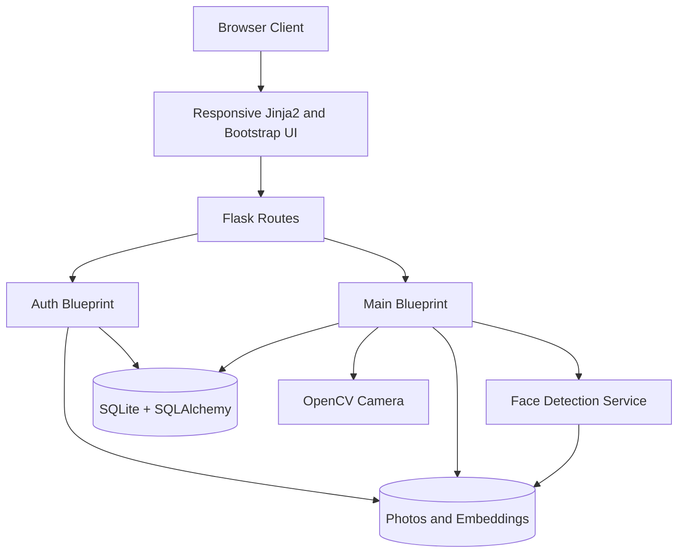
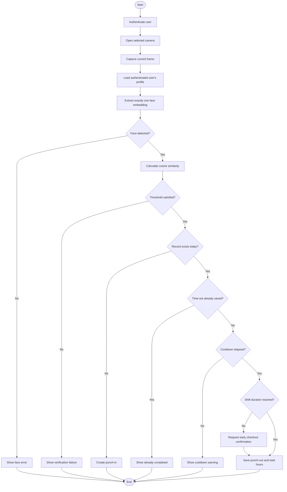
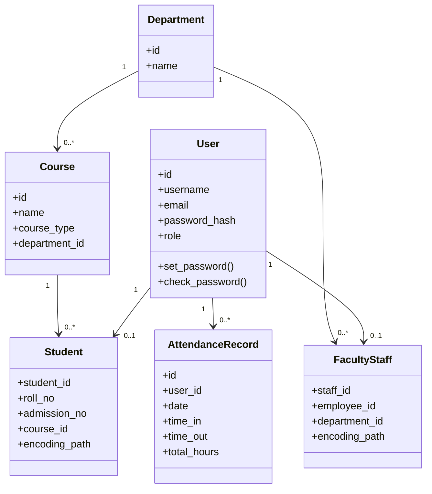
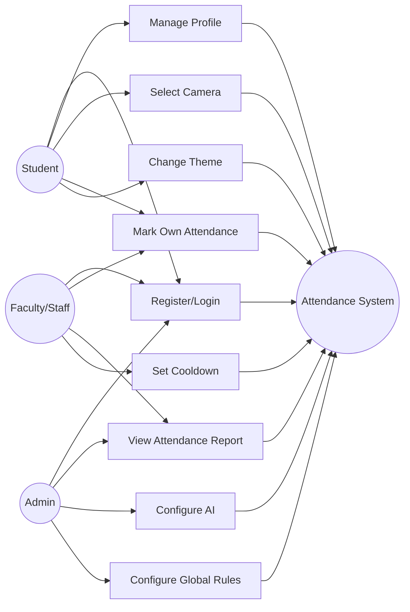

# Project Report
## Smart Face Recognition Attendance System

## Title Page

**Project Title:** Smart Face Recognition Attendance System  
**Technology:** Flask, Python, SQLAlchemy, OpenCV, InsightFace, SQLite  
**Project Type:** Mini Project  
**Academic Department:** ABES Engineering College  
**Academic Year:** 2026

> Replace the placeholders below before submission:
>
> - Student name and roll number
> - Faculty guide name
> - Department and section
> - Institution logo
> - Submission date

## Certificate

This is to certify that the project titled **Smart Face Recognition Attendance System** has been completed as part of the academic requirements under the guidance of the project supervisor.

## Declaration

I declare that this project report describes work completed for the Smart Face Recognition Attendance System and that external libraries and references have been acknowledged appropriately.

## Acknowledgement

The project team acknowledges the guidance of the faculty supervisor, the department, and the open-source communities that maintain Flask, SQLAlchemy, OpenCV, InsightFace, Bootstrap, and related tools.

## Abstract

Manual attendance collection is time-consuming, repetitive, and vulnerable to proxy attendance and data-entry errors. The Smart Face Recognition Attendance System provides a web-based solution that combines role-based authentication, face embedding enrollment, live camera capture, and attendance reporting. A registered face photograph is processed through InsightFace to produce a feature embedding. During attendance marking, the system extracts an embedding from the authenticated user's camera frame and compares it using cosine similarity. A successful match creates a daily attendance record with punch-in and punch-out information.

The application uses Flask blueprints for authentication and main workflows, SQLAlchemy for normalized persistence, SQLite for development storage, OpenCV for camera streaming, and Jinja2/Bootstrap for the responsive interface. It also provides attendance filters, pagination, CSV export, profile management, and persistent settings.

**Keywords:** Face recognition, attendance automation, Flask, OpenCV, InsightFace, SQLAlchemy, biometric verification, web application.

## Chapter 1: Introduction

### 1.1 Background

Educational institutions require reliable attendance records for students, faculty, and staff. Paper registers and manual spreadsheets create delays and make it difficult to search historical records. Biometric verification can reduce manual intervention while maintaining a digital audit trail.

### 1.2 Problem Statement

A conventional attendance process may suffer from:

- Manual data-entry errors.
- Proxy attendance.
- Slow report preparation.
- Disconnected profile and attendance data.
- Difficulty managing attendance across courses and departments.

### 1.3 Proposed Solution

The proposed system authenticates users, links each account to a role-specific profile, stores a face embedding during enrollment, and verifies the current user through a live camera frame before recording attendance. Reports can be filtered and exported without manually preparing spreadsheets.

### 1.4 Objectives

1. Build a secure role-aware attendance web application.
2. Enroll and verify users through facial embeddings.
3. Record punch-in, punch-out, and total working hours.
4. Provide searchable and exportable attendance reports.
5. Provide configurable camera and attendance behavior.
6. Maintain a normalized, extensible database design.

## Chapter 2: Feasibility Study

### 2.1 Technical Feasibility

The system uses established Python libraries and a local SQLite database. OpenCV provides camera access, while InsightFace provides face detection and embeddings. The application can run locally on a laptop with a compatible camera and model runtime.

### 2.2 Operational Feasibility

The workflow is designed for users familiar with web forms. Registration, profile management, attendance capture, and reporting are separated into recognizable screens.

### 2.3 Economic Feasibility

The core software stack is open source. Initial deployment costs are limited to available hardware, camera access, and optional production hosting.

## Chapter 3: Requirements

### 3.1 Functional Requirements

- The system shall authenticate registered users.
- The system shall enforce supported registration roles.
- The system shall store student and faculty/staff profile details.
- The system shall extract and store one face embedding per profile.
- The system shall stream a selected camera source.
- The system shall verify the authenticated user's face.
- The system shall prevent duplicate attendance for the same user and date.
- The system shall support punch-in and punch-out.
- The system shall support filtering and pagination.
- The system shall export attendance records as CSV.
- The system shall persist role-aware settings.

### 3.2 Non-Functional Requirements

- Passwords shall never be stored in plain text.
- Protected routes shall require authentication.
- Form submissions shall use CSRF protection.
- Uploads shall be size-limited.
- The interface shall be responsive on desktop and mobile screens.
- The database schema shall maintain referential integrity.
- The system should provide useful error responses.

### 3.3 Hardware Requirements

- Computer with Python 3 support.
- Webcam or compatible external camera.
- Sufficient CPU and memory for InsightFace inference.
- Disk space for face images, embeddings, and the SQLite database.

### 3.4 Software Requirements

- Python 3.10 or compatible version supported by `requirements.txt`.
- Flask and SQLAlchemy dependencies.
- OpenCV and ONNX Runtime.
- InsightFace model assets.
- Modern browser with JavaScript enabled.

## Chapter 4: System Design

### 4.1 High-Level Architecture

### 4.2 Attendance Activity Diagram

### 4.3 Class Diagram

### 4.4 Use Case Diagram

## Chapter 5: Database Schema

The project uses SQLite and SQLAlchemy. The central `users` table stores login data. One-to-one role profile tables hold domain-specific information. Departments and courses are normalized reference tables. Attendance references the user and optional operator. Settings use a key-value table.

### Relationship Summary

- `users.id` -> `students.student_id`
- `users.id` -> `faculty_staff.staff_id`
- `departments.id` -> `courses.department_id`
- `departments.id` -> `faculty_staff.department_id`
- `courses.id` -> `students.course_id`
- `users.id` -> `attendance_records.user_id`
- `users.id` -> `attendance_records.marked_by_operator_id`
- Unique `(attendance_records.user_id, attendance_records.date)`

For the complete column-level schema and ER diagram, see [PROJECT_DOCUMENTATION.md](PROJECT_DOCUMENTATION.md).

## Chapter 6: Implementation

### 6.1 Registration

The registration workflow collects role, credentials, profile information, and a face photograph. The uploaded file is size-limited, processed by InsightFace, and accepted only when exactly one face is detected. The embedding is saved in the encodings directory and the profile stores its path.

### 6.2 Login

The login route checks credentials, verifies the selected role against the stored role, checks account activation, and creates a Flask-Login session.

### 6.3 Face Verification

The camera stream is opened for the authenticated user. A captured frame is processed into an embedding. The saved and live embeddings are compared using cosine similarity. A configurable threshold determines acceptance.

### 6.4 Attendance Recording

The server derives the target identity from the authenticated session rather than trusting browser-submitted identifiers. The first successful scan creates a punch-in record. A later scan can save punch-out and total hours after the configured cooldown. A database uniqueness constraint prevents more than one daily record.

### 6.5 Reporting

The summary route supports date, search, course, and status filters. Server-side pagination reduces response size. The export route generates a CSV file using the same filter values.

## Chapter 7: Testing and Results

### 7.1 Static Validation Completed

- Python compilation for changed modules.
- Jinja2 parsing for changed templates.
- Editor diagnostics.
- CRLF-aware whitespace validation.

### 7.2 Suggested Test Cases

| Test case | Expected result |
| --- | --- |
| Invalid registration role | Request rejected |
| Missing `SECRET_KEY` | Application refuses startup |
| Wrong login role | Login rejected |
| Password reset | `password_hash` changes |
| Two daily scans | One daily record only |
| Wrong face | Attendance rejected |
| More than one face in image | Enrollment/verification rejected |
| Camera source `1` | User-specific camera is opened |
| CSV export with filters | Download matches filtered report |

### 7.3 Current Runtime Limitation

End-to-end face verification requires InsightFace model assets and a working camera. These dependencies must be installed and available before the complete workflow can be tested.

## Chapter 8: Security, Privacy, and Ethics

Face embeddings and photographs are biometric information. The deployment should define consent, purpose limitation, retention, deletion, access logging, and incident response procedures. Production configuration should use HTTPS, secure cookies, protected upload storage, a real email provider, and a managed database migration process.

## Chapter 9: Future Enhancements

- Add a formal migration system such as Flask-Migrate/Alembic.
- Add automated unit, integration, and security tests.
- Add an admin user-management screen.
- Add real email delivery and one-time password-reset tokens.
- Add camera discovery instead of fixed indexes `0` and `1`.
- Add configurable academic calendar, late thresholds, holidays, and leave management.
- Add audit logs for settings and administrative actions.
- Add background camera/face processing for production scale.
- Add PostgreSQL support for multi-user deployment.
- Add biometric encryption and protected object storage.

## Chapter 10: Conclusion

The Smart Face Recognition Attendance System demonstrates how biometric verification, web application design, and relational data modeling can be combined to automate attendance workflows. The current implementation provides the core enrollment, verification, recording, reporting, and settings features. Production readiness depends on model deployment, migration tooling, automated tests, camera concurrency design, and a documented biometric privacy policy.

## References

- Flask Documentation: <https://flask.palletsprojects.com/>
- SQLAlchemy Documentation: <https://docs.sqlalchemy.org/>
- OpenCV Documentation: <https://docs.opencv.org/>
- InsightFace Project: <https://github.com/deepinsight/insightface>
- Bootstrap Documentation: <https://getbootstrap.com/docs/5.0/>
